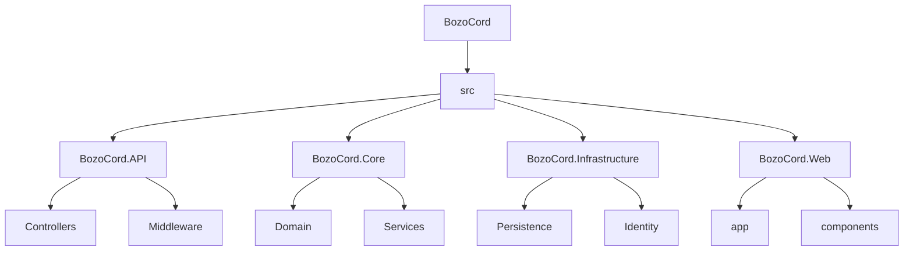
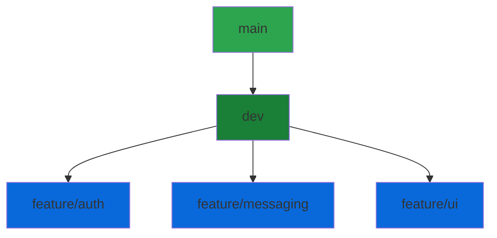
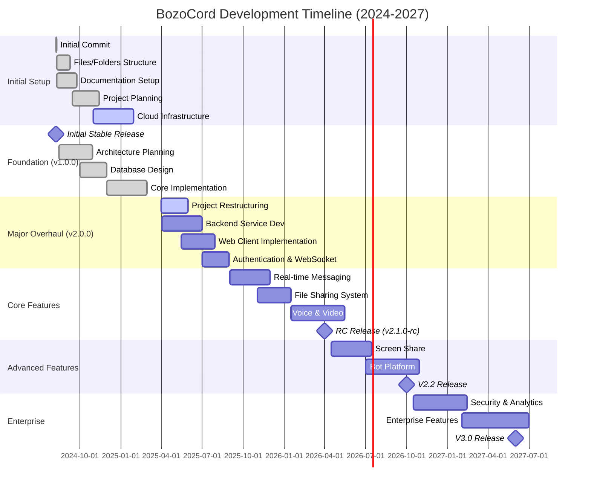

# BozoCord

<div align="center">

[](https://github.com/Nanaimo2013/BozoCord)

### 🚀 A Modern, Real-Time Communication Platform

*Built with .NET 8.0, Next.js 14, and SignalR*

<div align="center">

[](https://github.com/Nanaimo2013/BozoCord/releases/latest/download/BozoCord.Installer.exe)

</div>

<p align="center">
  <a href="#-features">Features</a> •
  <a href="#-quick-start">Quick Start</a> •
  <a href="#-documentation">Docs</a> •
  <a href="#-contributing">Contributing</a> •
  <a href="#-support">Support</a>
</p>

### Project Status

[](https://github.com/Nanaimo2013/BozoCord/releases)
[](https://github.com/Nanaimo2013/BozoCord/releases/latest)
[](https://github.com/Nanaimo2013/BozoCord/actions)
[](https://github.com/Nanaimo2013/BozoCord)

### Stats & Info

[](https://github.com/Nanaimo2013/BozoCord/stargazers)
[](https://github.com/Nanaimo2013/BozoCord/releases)
[](https://github.com/Nanaimo2013/BozoCord/graphs/contributors)
[](https://github.com/Nanaimo2013/BozoCord/network/members)

### Development

[](https://github.com/Nanaimo2013/BozoCord/issues)
[](https://github.com/Nanaimo2013/BozoCord)
[](https://github.com/Nanaimo2013/BozoCord)
[](LICENSE.md)

</div>

## 🌟 Highlights

<table>
<tr>
<td width="50%">

### 🔥 Key Features

- **Real-time Communication**
  - Instant messaging with SignalR
  - Voice & video calls (WebRTC)
  - File sharing & media preview
- **Modern Architecture**
  - .NET 8.0 backend
  - Next.js 14 frontend
  - PostgreSQL & Redis
- **Enterprise Security**
  - End-to-end encryption
  - JWT authentication
  - Role-based access control

</td>
<td width="50%">

### 🛠️ Tech Stack

- **Backend**
  - .NET 8.0
  - Entity Framework Core
  - SignalR
- **Frontend**
  - Next.js 14
  - TypeScript
  - TailwindCSS
- **Infrastructure**
  - PostgreSQL
  - Redis
  - Docker
  - Kubernetes

</td>
</tr>
</table>

## 📦 Quick Start

<details>
<summary>🔽 Download & Install</summary>

### Windows Installer (Recommended)

<div align="center">

[](https://github.com/Nanaimo2013/BozoCord/releases/latest/download/BozoCord.Installer.exe)

</div>

1. Download the installer
2. Run `BozoCord.Installer.exe`
3. Follow the installation wizard
4. Launch BozoCord from your desktop

### Manual Installation

If the installer doesn't work, you can manually install BozoCord:

1. Download the latest release:
   ```bash
   # Choose one:
   ✅ [Download Portable ZIP](https://github.com/Nanaimo2013/BozoCord/releases/latest/download/BozoCord.zip)
   ✅ [Download Standalone EXE](https://github.com/Nanaimo2013/BozoCord/releases/latest/download/BozoCord.exe)
   ```

2. Installation Options:
   <details>
   <summary>📦 Portable ZIP</summary>
   
   ```bash
   1. Extract BozoCord.zip to your desired location
   2. Run BozoCord.exe from the extracted folder
   3. Optional: Create desktop shortcut
   ```
   </details>

   <details>
   <summary>⚡ Standalone EXE</summary>
   
   ```bash
   1. Move BozoCord.exe to your desired location
   2. Run BozoCord.exe
   3. Optional: Create desktop shortcut
   ```
   </details>

### Troubleshooting

<details>
<summary>🔧 Common Issues</summary>

- **Installer Not Running**
  1. Try running as administrator
  2. Check Windows SmartScreen settings
  3. Verify your antivirus isn't blocking
  4. Use manual installation method

- **Missing Dependencies**
  1. Install [.NET 8.0 Runtime](https://dotnet.microsoft.com/download/dotnet/8.0)
  2. Install [WebView2 Runtime](https://developer.microsoft.com/en-us/microsoft-edge/webview2/)

- **Need Help?**
  - [📖 Installation Guide](docs/installation.md)
  - [💬 Discord Support](https://discord.gg/bozocord)
  - [📝 GitHub Issues](https://github.com/Nanaimo2013/BozoCord/issues)
</details>

</details>

<details>
<summary>🛠️ Development Setup</summary>

### Prerequisites

<div align="center">

[](https://dotnet.microsoft.com/download/dotnet/8.0)
[](https://nodejs.org/)
[](https://www.docker.com/)
[](https://code.visualstudio.com/)
[](https://www.postgresql.org/)
[](https://redis.io/)

</div>

### Option 1: Docker Compose (Recommended)

```bash
# Clone the repository
git clone https://github.com/Nanaimo2013/BozoCord.git
cd BozoCord

# Start all services
docker-compose up -d

# Access the application
Frontend ➜ http://localhost:3000
API ➜ http://localhost:5000
Swagger ➜ http://localhost:5000/swagger
```

### Option 2: Manual Setup

<details>
<summary>Step-by-Step Instructions</summary>

1. **Clone & Setup**
   ```bash
   git clone https://github.com/Nanaimo2013/BozoCord.git
   cd BozoCord
   ```

2. **Database Setup**
   ```bash
   # Start PostgreSQL
   docker run -d --name bozocord-db -p 5432:5432 -e POSTGRES_PASSWORD=dev postgres

   # Start Redis
   docker run -d --name bozocord-redis -p 6379:6379 redis
   ```

3. **Backend Setup**
   ```bash
   cd src/BozoCord.API
   dotnet restore
   dotnet build
   dotnet run
   ```

4. **Frontend Setup**
   ```bash
   cd src/BozoCord.Web
   npm install
   npm run dev
   ```

5. **Access Points**
   ```
   Frontend ➜ http://localhost:3000
   API ➜ http://localhost:5000
   Swagger ➜ http://localhost:5000/swagger
   ```
</details>

### Option 3: All-in-One Script

```bash
# Windows (PowerShell)
./scripts/setup.ps1

# Linux/macOS
./scripts/setup.sh
```

This script will:
1. Check prerequisites
2. Install dependencies
3. Configure environment
4. Start all services
5. Open the application

### Development Tools

<details>
<summary>Recommended Extensions</summary>

- [C# Dev Kit](https://marketplace.visualstudio.com/items?itemName=ms-dotnettools.csdevkit)
- [Docker](https://marketplace.visualstudio.com/items?itemName=ms-azuretools.vscode-docker)
- [ESLint](https://marketplace.visualstudio.com/items?itemName=dbaeumer.vscode-eslint)
- [Prettier](https://marketplace.visualstudio.com/items?itemName=esbenp.prettier-vscode)
</details>

</details>

## 🏗️ Architecture

<details>
<summary>View Project Structure</summary>



### Key Components

| Component | Description | Documentation |
|-----------|-------------|---------------|
| [`BozoCord.API`](src/BozoCord.API) | REST API endpoints & real-time communication | [API Docs](docs/api/README.md) |
| [`BozoCord.Core`](src/BozoCord.Core) | Business logic & domain models | [Core Docs](docs/core/README.md) |
| [`BozoCord.Infrastructure`](src/BozoCord.Infrastructure) | Data access & external services | [Infrastructure Docs](docs/infrastructure/README.md) |
| [`BozoCord.Web`](src/BozoCord.Web) | Next.js frontend application | [Web Docs](docs/web/README.md) |

</details>

## 🌿 Development

<details>
<summary>Branching Strategy</summary>



### Branch Rules
- `main`: Production code only. Requires PR review and passing tests
- `dev`: Development branch. All features merge here first
- `feature/*`: New features, bug fixes, etc.

### Development Workflow
1. Create feature branch from `dev`:
   ```bash
   git checkout dev
   git pull
   git checkout -b feature/your-feature
   ```

2. Make changes and commit:
   ```bash
   git add .
   git commit -m "feat: add your feature"
   ```

3. Push feature branch:
   ```bash
   git push -u origin feature/your-feature
   ```

4. Create Pull Request to `dev` branch

5. After review and approval, merge to `dev`

6. Periodically, `dev` is merged into `main` for releases

</details>

<details>
<summary>Versioning</summary>

We use [SemVer](https://semver.org/) for versioning. For the versions available, see the [tags on this repository](https://github.com/Nanaimo2013/BozoCord/tags).

### Version Format
`MAJOR.MINOR.PATCH`
- MAJOR version for incompatible API changes
- MINOR version for added functionality in a backward compatible manner
- PATCH version for backward compatible bug fixes

### Release Tags
- `v1.0.0` - Stable releases
- `v1.0.0-beta.1` - Beta releases
- `v1.0.0-alpha.1` - Alpha releases
- `v1.0.0-rc.1` - Release candidates

### Creating a New Release
1. Update version in project files
2. Update CHANGELOG.md
3. Create and push tag:
   ```bash
   git checkout main
   git pull
   git tag -a v1.0.0 -m "Release version 1.0.0"
   git push origin v1.0.0
   ```

</details>

## 🛣️ Roadmap

<details>
<summary>View Development Timeline & Progress</summary>

### Current Status Overview

| Phase | Progress | Status | Key Achievements |
|-------|----------|--------|-----------------|
| Initial Setup |  | ✅ Complete | - Repository Structure<br>- Documentation Framework<br>- CI/CD Pipeline |
| Foundation |  | 🟨 In Progress | - Architecture Design<br>- Database Schema<br>- Cloud Integration |
| Authentication |  | 🟦 Starting | - Basic Auth Flow<br>- JWT Implementation |
| Core Features |  | 📅 Planned | - Initial Planning<br>- Architecture Review |
| Advanced |  | 🔮 Future | - Research Phase |

### Detailed Timeline



### Component Progress (As of April 2, 2025)

| Component | Status | Progress | Features Complete | In Progress | Next Steps |
|-----------|--------|----------|------------------|-------------|------------|
| **API** | 🟨 Active |  | - Basic Endpoints<br>- Error Handling | - WebSocket Setup<br>- Rate Limiting | - Auth Integration<br>- API Documentation |
| **Core** | 🟨 Active |  | - Domain Models<br>- Basic Services | - Event System<br>- Validation | - Message Service<br>- User Service |
| **Infrastructure** | 🟦 Starting |  | - Database Schema<br>- Basic Config | - AWS Setup<br>- Docker Config | - Redis Cache<br>- Monitoring |
| **Web** | 📅 Planned |  | - Project Setup<br>- Basic UI | - Component Library<br>- Routing | - State Management<br>- Real-time Features |

### Infrastructure Status

| Service | Status | Region | Last Updated | Health |
|---------|--------|--------|--------------|--------|
| API Gateway | 🟢 Online | US-East | 2025-04-02 |  |
| Database | 🟢 Online | US-East | 2025-04-02 |  |
| Redis Cache | 🟡 Partial | US-East | 2025-04-02 |  |
| Storage | 🟢 Online | Global | 2025-04-02 |  |
| CDN | 🟢 Online | Global | 2025-04-02 |  |

### Development Checkpoints

| Checkpoint | Target Date | Dependencies | Progress | Key Deliverables |
|------------|-------------|--------------|----------|------------------|
| CP1 | Apr 15, 2025 | None |  | Backend Infrastructure |
| CP2 | May 15, 2025 | CP1 |  | Frontend Foundation |
| CP3 | July 1, 2025 | CP1, CP2 |  | Core Features |
| CP4 | Oct 1, 2025 | CP3 |  | Platform Stability |
| CP5 | Jan 1, 2026 | CP4 |  | Advanced Features |
| CP6 | Apr 1, 2026 | CP5 |  | Enterprise Ready |

### Version Release Schedule

| Version | Target Date | Priority | Status | Features |
|---------|-------------|----------|---------|-----------|
| v2.0.1 | Apr 15, 2025 | 🔴 High | 🟨 Active | - Backend Service<br>- Docker Setup<br>- CI/CD Pipeline |
| v2.0.2 | May 1, 2025 | 🔴 High | 📅 Planned | - Web Client<br>- API Endpoints<br>- Database Schema |
| v2.0.3 | May 15, 2025 | 🟡 Medium | 📅 Planned | - WebSocket<br>- Security Setup<br>- Monitoring |
| v2.1.0-alpha | June 1, 2025 | 🟡 Medium | 🔮 Future | - Authentication<br>- User Profiles |
| v2.1.0-beta | July 1, 2025 | 🟢 Low | 🔮 Future | - Messaging<br>- File Sharing |

### Next Steps (Priority Tasks)

| Task | Priority | Dependencies | Target Date | Status |
|------|----------|--------------|-------------|---------|
| Backend Service Setup | 🔴 High | None | Apr 15, 2025 | 🟨 In Progress |
| API Implementation | 🔴 High | Backend | May 1, 2025 | 🟦 Starting |
| Database Migration | 🟡 Medium | Backend | May 15, 2025 | 📅 Planned |
| WebSocket Integration | 🟡 Medium | API | June 1, 2025 | 📅 Planned |
| Frontend Development | 🟢 Low | API | June 15, 2025 | 📅 Planned |

</details>

## 🤝 Contributing

<details>
<summary>How to Contribute</summary>

We welcome contributions! Please see our [Contributing Guide](CONTRIBUTING.md) for details.

### Development Workflow

1. Fork the repository
2. Create your feature branch (`git checkout -b feature/AmazingFeature`)
3. Commit your changes (`git commit -m 'Add some AmazingFeature'`)
4. Push to the branch (`git push origin feature/AmazingFeature`)
5. Open a Pull Request

</details>

## 📚 Documentation

<details>
<summary>Available Resources</summary>

- [📖 API Documentation](docs/api/README.md)
- [🏗️ Architecture Guide](docs/architecture.md)
- [🔧 Development Setup](docs/development.md)
- [📱 Mobile Apps](docs/mobile/README.md)
- [🔒 Security](SECURITY.md)
- [📜 Terms of Service](TERMS_OF_SERVICE.md)

</details>

## 📄 License

<details>
<summary>License Information</summary>

This project is protected under a custom license that carefully balances open-source principles with commercial interests. See the [LICENSE.md](LICENSE.md) file for the complete terms.

### Quick Overview

✅ Allowed:
- Personal use
- Educational use
- Development and testing
- Contributing via pull requests
- Private instances

⚠️ Requires Permission:
- Commercial use
- Public deployments
- Derivative works
- Redistributions

❌ Not Allowed:
- Unauthorized commercial use
- Removing attribution
- Using BozoCord branding
- Training AI/ML models
- Creating competing products

### License Badges

<div align="center">

[](LICENSE.md)
[](LICENSE.md)
[](LICENSE.md)
[](https://coming.soon/terms)
[](https://coming.soon/security-policy)

</div>

```
Copyright © 2024-2025 NansStudios. All rights reserved.
```

For licensing inquiries: coming.soon@nansstudios.com

</details>

## 💬 Community & Support

<div align="center">

[](https://discord.gg/bozocord)
[](https://twitter.com/Nanaimo_2013)
[](https://github.com/Nanaimo2013/BozoCord/discussions)

</div>

---

<div align="center">

Made with ❤️ by [NansStudios](https://github.com/Nanaimo2013)

</div>

<div align="center">

### *BozoCord*

*Where Communities Thrive, Connections Come Alive*

<sub>Your Voice • Your Community • Your Future</sub>

</div>

