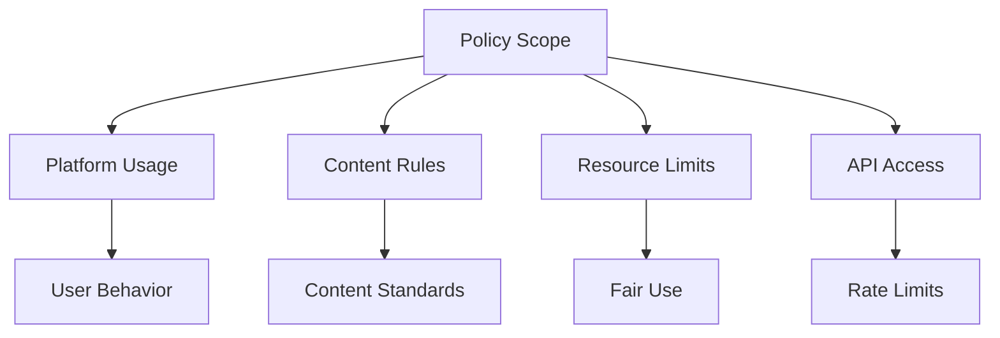
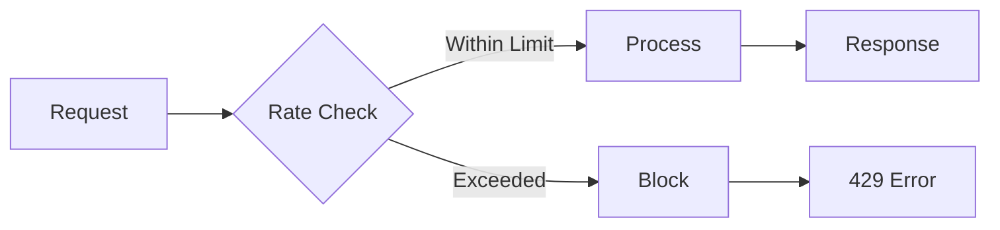
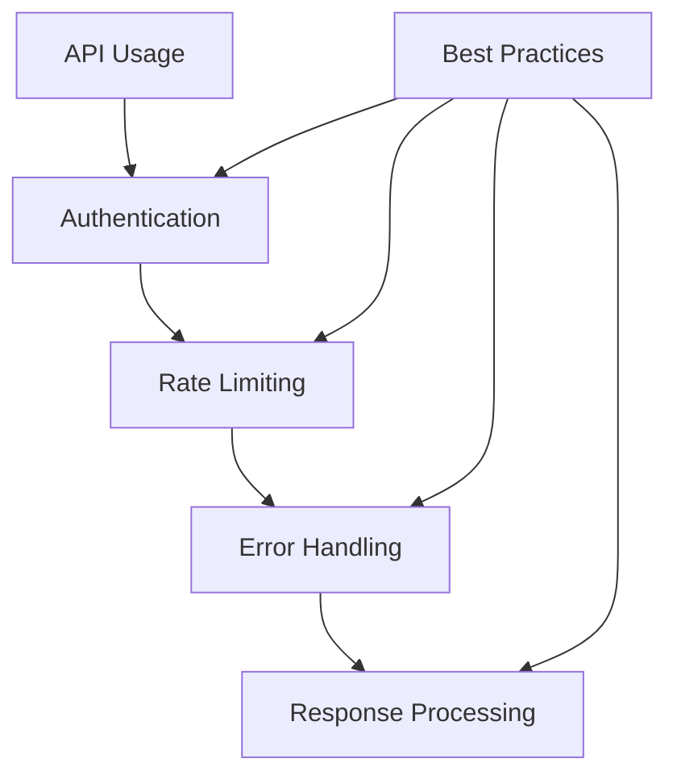

# Acceptable Use Policy 📜

## Table of Contents
- [Overview](#overview)
- [Permitted Use](#permitted-use)
- [Prohibited Use](#prohibited-use)
- [Resource Limits](#resource-limits)
- [Content Guidelines](#content-guidelines)
- [API Usage](#api-usage)
- [Monitoring & Enforcement](#monitoring--enforcement)
- [Violations & Reporting](#violations--reporting)

## Overview 📋

This Acceptable Use Policy outlines the proper use of BozoCord services and resources.

### Scope of Policy

## Permitted Use ✅

### Authorized Activities
| Activity Type | Description | Requirements | Limits |
|--------------|-------------|--------------|---------|
| Personal Use | Individual usage | Basic account | Standard limits |
| Team Collaboration | Group work | Team account | Team limits |
| Educational | Learning & teaching | Academic email | Educational limits |
| Open Source | Non-commercial projects | License compliance | Project limits |

### Development Usage

Permitted Development Activities

- ✅ Local development
- ✅ Testing and QA
- ✅ Bug reporting
- ✅ Feature requests
- ✅ Documentation contributions
- ✅ Pull requests
- ✅ Code reviews

## Prohibited Use ❌

### Strictly Forbidden Activities

Security Violations

- 🚫 Unauthorized access attempts
- 🚫 Security scanning without permission
- 🚫 Vulnerability exploitation
- 🚫 Credential sharing
- 🚫 Security control bypass

Content Violations

- 🚫 Illegal content
- 🚫 Malicious code
- 🚫 Unauthorized bots
- 🚫 Spam or advertising
- 🚫 Harassment or abuse

Resource Abuse

- 🚫 DDoS attacks
- 🚫 Resource hogging
- 🚫 Rate limit bypass
- 🚫 Unauthorized scraping
- 🚫 System overload

## Resource Limits 📊

### Service Quotas

| Resource | Basic Tier | Pro Tier | Enterprise |
|----------|------------|-----------|------------|
| API Calls | 1000/day | 10000/day | Custom |
| Storage | 5GB | 50GB | Custom |
| Bandwidth | 10GB/month | 100GB/month | Custom |
| Concurrent Users | 100 | 1000 | Custom |

### Rate Limiting

## Content Guidelines 📝

### Acceptable Content
- ✅ Professional communications
- ✅ Project documentation
- ✅ Technical discussions
- ✅ Community contributions
- ✅ Educational material

### Content Standards
1. Professional Conduct
   - Respectful communication
   - Constructive feedback
   - Inclusive language
   - Clear documentation

2. Quality Standards
   - Accurate information
   - Well-formatted content
   - Proper attribution
   - Regular updates

## API Usage 🔌

### API Guidelines
1. Authentication
   - Use proper API keys
   - Secure key storage
   - Regular key rotation
   - Access scope limits

2. Request Standards
   - Proper headers
   - Valid parameters
   - Error handling
   - Response processing

### Best Practices

## Monitoring & Enforcement 👮

### Automated Monitoring
- Resource usage tracking
- Rate limit monitoring
- Security scanning
- Performance metrics
- Error logging

### Manual Reviews
- Code reviews
- Content moderation
- Security audits
- Usage patterns
- User reports

## Violations & Reporting 🚨

### Violation Levels
| Level | Description | Response Time | Action |
|-------|-------------|---------------|---------|
| Low | Minor issues | 24 hours | Warning |
| Medium | Serious concerns | 12 hours | Temporary suspension |
| High | Critical problems | 1 hour | Immediate block |
| Critical | Security threats | Immediate | Account termination |

### Reporting Process
1. Identify violation
2. Gather evidence
3. Submit report
4. Await response
5. Follow up

### Contact Methods
- 🚨 [Report Violation](https://github.com/Nanaimo2013/BozoCord/issues)
- 💬 [Ask Questions](https://github.com/Nanaimo2013/BozoCord/discussions)
- 📝 [Submit Feedback](https://github.com/Nanaimo2013/BozoCord/discussions)

## Appeals Process 📋

### Appeal Steps
1. Review violation
2. Prepare explanation
3. Submit appeal
4. Provide evidence
5. Await decision

Appeal Requirements

- Clear explanation
- Supporting evidence
- Corrective actions
- Prevention plan
- Contact information

---

**[Terms of Service](TERMS_OF_SERVICE.md)** •
**[Privacy Policy](PRIVACY_POLICY.md)** •
**[Security Policy](SECURITY.md)**

Last Updated: April 2024

 