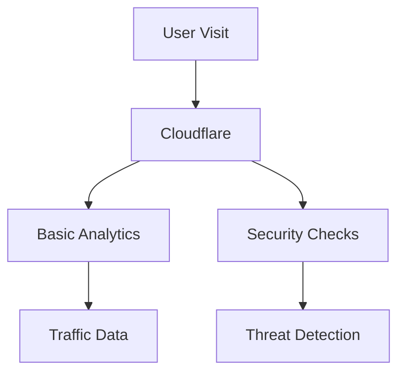
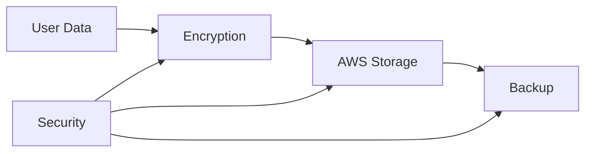

# Privacy Policy 🔒

## Table of Contents
- [Overview](#overview)
- [Data Collection](#data-collection)
- [Data Usage](#data-usage)
- [Data Storage](#data-storage)
- [Your Rights](#your-rights)
- [Third Parties](#third-parties)
- [Contact](#contact)

## Overview 📋

This privacy policy explains how BozoCord handles your data. We aim to be transparent and collect only what's necessary.

## Data Collection 📊

### Essential Data
| Data Type | Purpose | Storage Location | Retention |
|-----------|---------|------------------|-----------|
| Email | Authentication | AWS RDS | Account lifetime |
| Username | Identification | AWS RDS | Account lifetime |
| Password Hash | Security | AWS RDS | Account lifetime |
| IP Address | Security | Cloudflare | 30 days |

### Optional Data
| Data Type | Purpose | Storage Location | Retention |
|-----------|---------|------------------|-----------|
| Profile Picture | Customization | AWS S3 | Account lifetime |
| Status Message | Social | AWS RDS | Until changed |
| Time Zone | UX | AWS RDS | Until changed |

### Automatic Collection

## Data Usage 🔍

### Primary Uses
- Account management
- Service provision
- Security measures
- Performance monitoring

### Analytics
We use basic analytics to:
- Monitor service health
- Detect issues
- Improve performance
- Track usage patterns

Analytics Details

- Cloudflare analytics
- AWS CloudWatch metrics
- Basic error logging
- Performance data

No personal data is used for analytics.

## Data Storage 💾

### Storage Locations
1. **AWS RDS**
   - User accounts
   - Application data
   - Settings
   - Encrypted at rest

2. **AWS S3**
   - Profile pictures
   - Uploaded files
   - Public assets
   - Encrypted storage

3. **Cloudflare**
   - Temporary caching
   - Security logs
   - Performance data
   - Auto-purged regularly

### Data Protection

## Your Rights ✅

You have the right to:
- [x] Access your data
- [x] Delete your account
- [x] Export your data
- [x] Update information
- [x] Opt out of analytics

### Data Access
1. Log into your account
2. Visit settings
3. Use data export tool
4. Request additional data

### Account Deletion
1. Log into your account
2. Go to account settings
3. Choose "Delete Account"
4. Confirm deletion

Deletion Process

- Account marked for deletion
- 30-day recovery period
- Data permanently deleted
- Backups cleared in 90 days

## Third Parties 🤝

### Service Providers
| Provider | Purpose | Data Access |
|----------|---------|-------------|
| AWS | Hosting | Limited |
| Cloudflare | Security | Limited |

### Data Sharing
We do not:
- ❌ Sell your data
- ❌ Share with advertisers
- ❌ Use for marketing
- ❌ Track across sites

## Security Measures 🛡️

### Infrastructure
- AWS security features
- Cloudflare protection
- Encrypted storage
- Secure transmission

### Access Control
- Limited access
- Audit logging
- Security monitoring
- Regular updates

## Updates to Policy 📝

- Policy updates posted here
- Users notified of changes
- 30-day notice for major changes
- Previous versions archived

## Contact Us 📬

For privacy questions:
- 📧 [Issues](https://github.com/Nanaimo2013/BozoCord/issues)
- 💬 [Discussions](https://github.com/Nanaimo2013/BozoCord/discussions)

---

**[Terms of Service](TERMS_OF_SERVICE.md)** •
**[Security Policy](SECURITY.md)** •
**[Acceptable Use](ACCEPTABLE_USE.md)**

Last Updated: April 2024

 