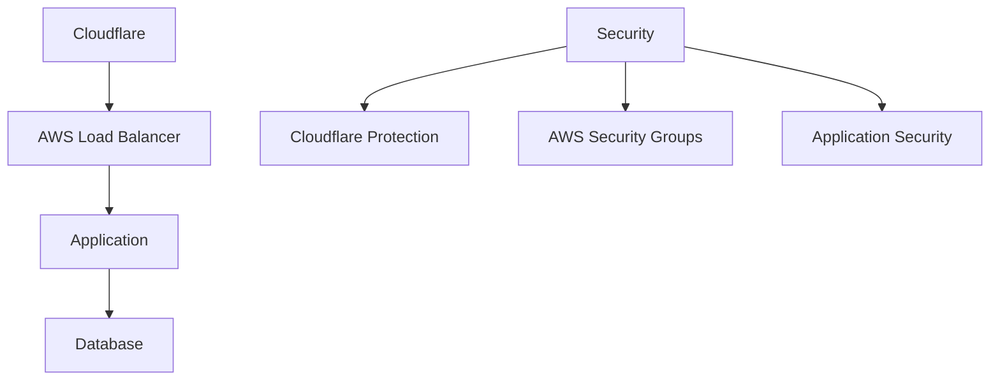

# Security Documentation 🛡️

## Table of Contents
- [Overview](#overview)
- [Cloud Security](#cloud-security)
- [Application Security](#application-security)
- [Data Protection](#data-protection)
- [Monitoring](#monitoring)
- [Incident Response](#incident-response)
- [Security FAQs](#security-faqs)

## Overview 📊

BozoCord implements security through trusted cloud providers and industry-standard practices:

## Cloud Security 🏗️

### Cloudflare Protection
- DDoS mitigation
- Web Application Firewall
- SSL/TLS encryption
- Rate limiting
- Bot protection

### AWS Security
- Security groups
- Network ACLs
- VPC isolation
- AWS WAF (optional)
- AWS Shield Standard

## Application Security 🔒

### Authentication
| Feature | Implementation | Status |
|---------|----------------|---------|
| Password Hashing | BCrypt | ✅ Active |
| Session Management | JWT | ✅ Active |
| Password Policy | Basic Rules | ✅ Active |
| Rate Limiting | Cloudflare | ✅ Active |

### Basic Security Measures
- Input validation
- CSRF protection
- XSS prevention
- SQL injection prevention
- Secure headers

## Data Protection 🛡️

### Data Security
- AWS RDS encryption
- HTTPS everywhere
- Secure cookie settings
- Environment variables
- No sensitive data in logs

### Backups
- AWS RDS automated backups
- Point-in-time recovery
- Regular backup testing
- 30-day retention

## Monitoring 📊

### AWS CloudWatch
- Basic metrics
- Error rate monitoring
- Resource utilization
- Cost alerts

### Cloudflare Analytics
- Traffic patterns
- Threat detection
- Performance metrics
- Cache analytics

## Incident Response 🚨

### Response Steps
1. 🔍 Identify
   - Check Cloudflare alerts
   - Review AWS logs
   - Assess impact

2. 🛑 Contain
   - Block traffic if needed
   - Restrict access
   - Document actions

3. 🛠️ Fix
   - Deploy patches
   - Update configurations
   - Test fixes

4. 📈 Recover
   - Restore services
   - Verify functionality
   - Monitor for issues

## Security FAQs 💭

Q: How is my data protected?

- Cloudflare SSL/TLS encryption
- AWS RDS encryption at rest
- Secure application practices
- Regular security updates

Q: How do you handle security issues?

- Monitor for security alerts
- Quick response to incidents
- Regular security patches
- User notifications when needed

## Best Practices for Users 👥

1. Account Security
   - Use strong passwords
   - Don't share credentials
   - Report suspicious activity
   - Keep email secure

2. Safe Usage
   - Use HTTPS
   - Verify connections
   - Follow guidelines
   - Update regularly

## Contact & Reporting 📞

### Security Contacts
- 🚨 Issues: [Security Advisory](https://github.com/Nanaimo2013/BozoCord/security/advisories/new)
- 💬 Questions: [Discussions](https://github.com/Nanaimo2013/BozoCord/discussions)

---

**[Report Issue](https://github.com/Nanaimo2013/BozoCord/security/advisories/new)** •
**[Documentation](../README.md)**

Secured by Cloudflare & AWS

## 🔗 Related Documents
- [Privacy Policy](PRIVACY_POLICY.md)
- [Terms of Service](TERMS_OF_SERVICE.md)
- [Acceptable Use](ACCEPTABLE_USE.md) 