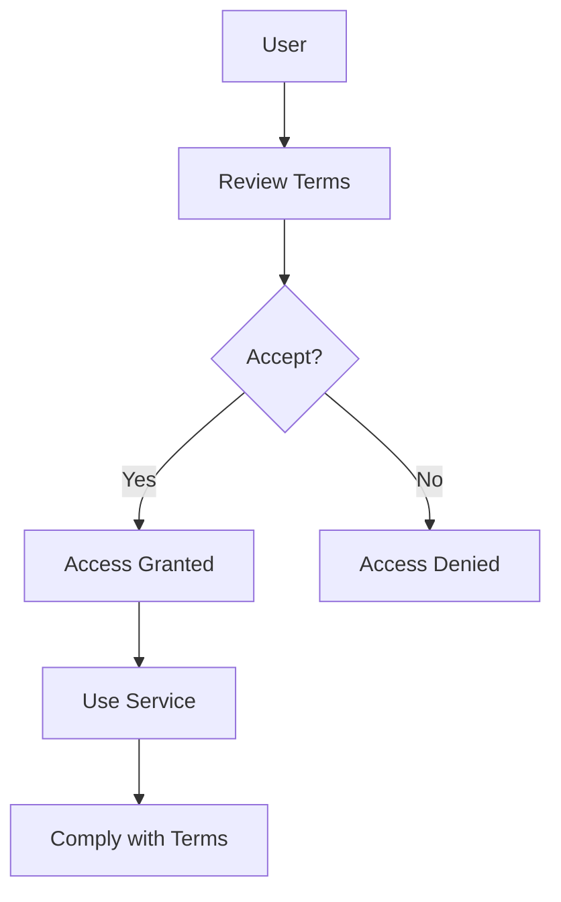
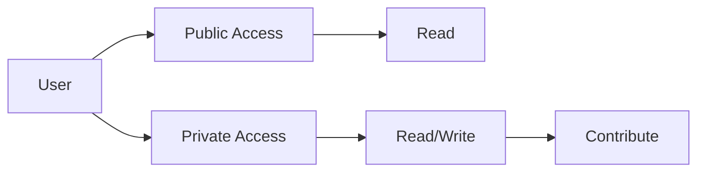
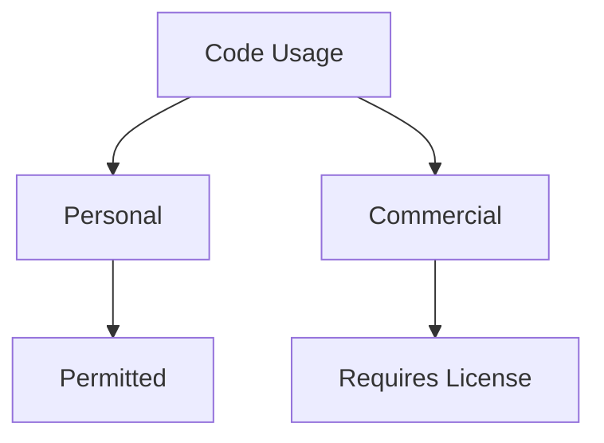
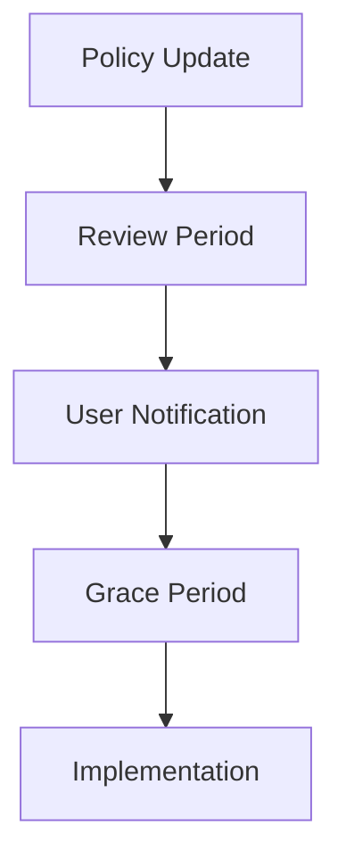

# Terms of Service 📋

## Table of Contents
- [Agreement](#agreement)
- [Service Terms](#service-terms)
- [User Obligations](#user-obligations)
- [GitHub Usage](#github-usage)
- [Repository Terms](#repository-terms)
- [Contributions](#contributions)
- [Licensing](#licensing)
- [Limitations](#limitations)
- [Termination](#termination)

## Agreement 📜

### Acceptance of Terms

By using BozoCord, you agree to:

- ✅ Follow all terms and conditions
- ✅ Comply with acceptable use policy
- ✅ Respect privacy policy
- ✅ Adhere to security guidelines
- ✅ Follow GitHub terms of service

## Service Terms 🔧

### Service Availability
- Best-effort uptime
- Scheduled maintenance
- Emergency updates
- Status monitoring

## User Obligations 👤

### Account Requirements
1. Accurate Information
   - Valid email
   - Real identity
   - Current contact details

2. Security Responsibilities
   - Strong passwords
   - 2FA when available
   - Secure access
   - Report issues

## GitHub Usage 🐙

### Repository Access

### Contribution Guidelines

Pull Request Requirements

- Follow [CONTRIBUTING.md](../CONTRIBUTING.md)
- Sign commits
- Pass CI checks
- Update documentation
- Follow code style

## Repository Terms 📚

### Usage Rights
| Action | Public Repo | Private Repo |
|--------|-------------|--------------|
| Fork | ✅ | Requires Permission |
| Clone | ✅ | Authorized Only |
| Contribute | ✅ | Team Only |
| Distribute | License Terms | Prohibited |

### Code Protection
- Copyright retained
- License compliance
- Attribution required
- No unauthorized use

## Contributions 🤝

### Submission Terms
1. Original Work
   - Your own code
   - Licensed components
   - Proper attribution

2. License Grant
   - Code licensing
   - Documentation
   - Asset rights

## Licensing 📄

### Code License

License Terms

- Project under custom license
- Contributions licensed
- Dependencies respected
- Rights reserved

### Usage Rights

## Limitations ⚠️

### Service Restrictions
| Restriction | Description | Enforcement |
|-------------|-------------|-------------|
| API Usage | Rate Limited | Automatic |
| Storage | Quota Based | Monitored |
| Processing | Fair Use | Automated |
| Bandwidth | Limited | Tracked |

### Legal Limitations
- No warranty
- Limited liability
- Use at own risk
- No guarantees

## Termination 🚫

### Termination Rights
1. By User
   - Account deletion
   - Data removal
   - Service discontinuation

2. By Service
   - Terms violation
   - Abuse detection
   - Legal requirements

### Appeal Process

Appeal Steps

1. Review violation
2. Submit appeal
3. Provide evidence
4. Await decision
5. Comply with outcome

## Updates & Changes 🔄

### Policy Updates
- Regular reviews
- User notification
- Grace period
- Version tracking

### Change Process

## Contact & Support 📞

### Support Channels
- 📧 [Issues](https://github.com/Nanaimo2013/BozoCord/issues)
- 💬 [Discussions](https://github.com/Nanaimo2013/BozoCord/discussions)
- 🔒 [Security](../github/SECURITY.md)
- 📚 [Documentation](../README.md)

### Legal Contact
For legal inquiries:
- 🚨 [Legal Issues](https://github.com/Nanaimo2013/BozoCord/issues)
- ⚖️ [Compliance](PRIVACY_POLICY.md)

---

**[Privacy Policy](PRIVACY_POLICY.md)** •
**[Security Policy](SECURITY.md)** •
**[Acceptable Use](ACCEPTABLE_USE.md)**

Last Updated: April 2024

 